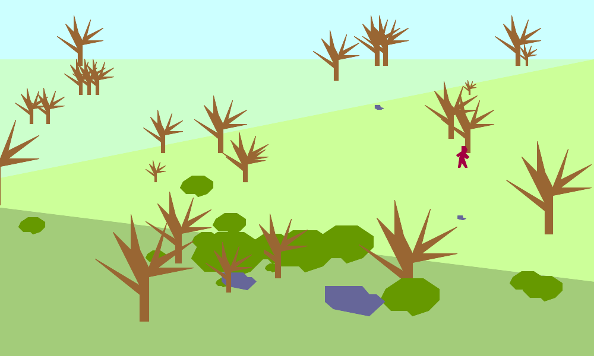

# mobot-sketch

This repository contains three javascript programs.

The first, called gardenPerspDraw.js, outputs a .png image from data gathered in a sketch at the Missouri Botanical Gardens in Saint Louis, Missouri.

To run gardenPerspDraw.js you must have GraphicsMagick and the gm node module installed.

The following commands run the program:

`node gardenPerspDraw.js data/mobot-persp-objects.json data/mobot-persp-horiz.json`

The next two programs, called gardenMapAscii.js and gardenMapAscii-2d.js, output .txt ASCII art files. They too, take data gathered at the Missouri Botanical Gardens as input.

These programs do not have any dependencies.

The following commands run the programs:

`node gardenMapAscii.js data/mobot-map1.json` 
or
`node gardenMapAscii.js data/mobot-map2.json`

and 

`node gardenMapAscii-2d.js data/mobot-map1.json`
or 
`node gardenMapAscii-2d.js data/mobot-map2.json`

All output goes to the /output directory.

They were written for fun and practice. I enjoyed putting the draw functions in a seperate file. I'm sure there are many ways I could have written this better.

I welcome feedback.

\- Pablo

